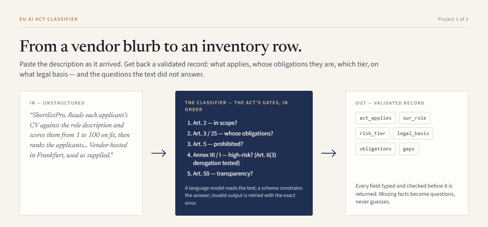
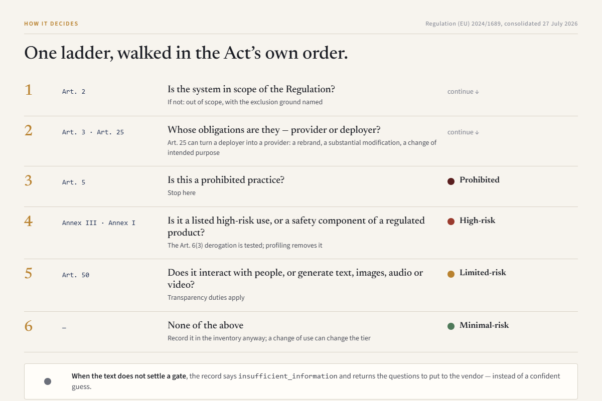
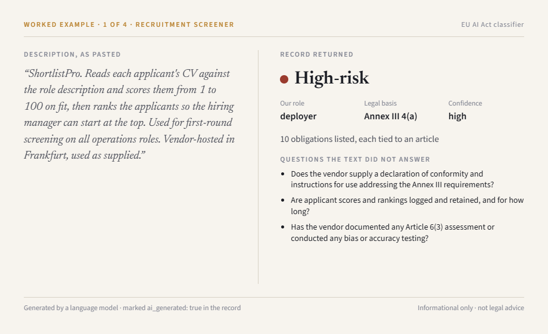
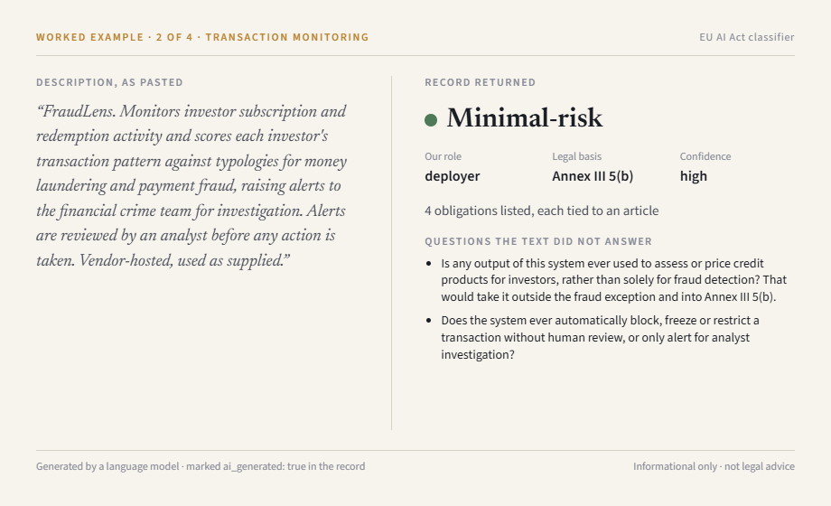
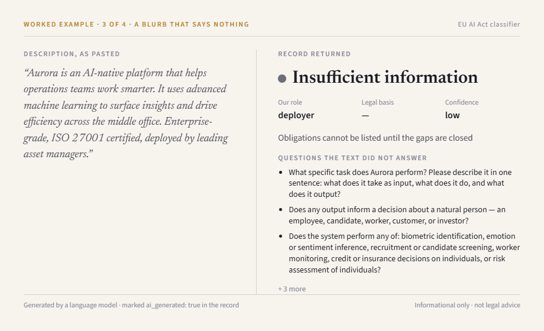
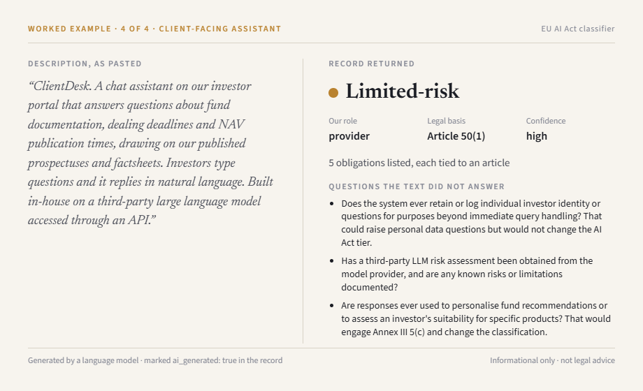
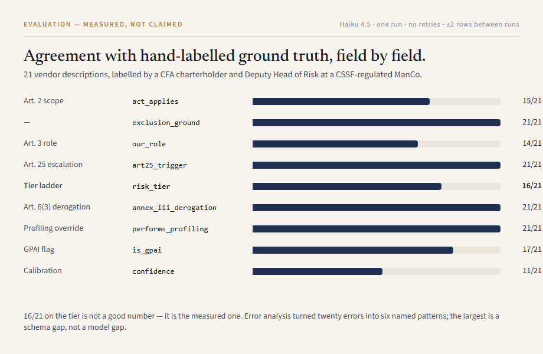
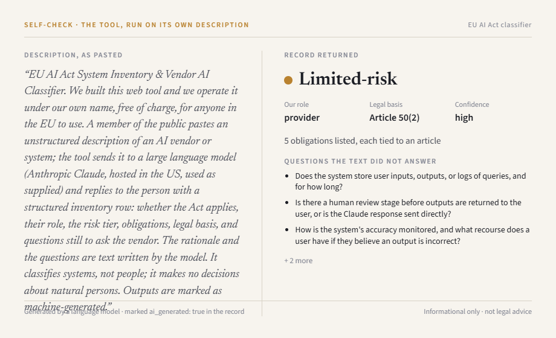

# EU AI Act System Inventory & Vendor AI Classifier

> Reads an unstructured vendor or system description and returns a validated AI
> Act inventory row: scope, role, risk tier, obligations, legal basis, and the
> questions still to put to the vendor.

**Live demo on request.** This page shows what the tool does and what it gets
wrong; nobody but me runs the model. Ask, and I will run it in front of you.

**Stack:** Python 3.11 · Anthropic Claude (Haiku 4.5) · Pydantic · FastAPI · Streamlit · Docker

*I automate the regulatory work I spent eight years doing by hand.*

A personal project, built on my own time and equipment. No employer data,
systems or documents were used; every description in this repository is
invented or public.

---

## The problem

A Luxembourg management company has to build an inventory of the AI systems it
uses, classify each one under Regulation (EU) 2024/1689, and be able to defend
that classification to a Conducting Officer and eventually to the CSSF. The
input is not a form. It is forty vendor blurbs, procurement notes and intranet
pages that say what a tool is *for* and almost never say what it *does*.

Two good free tools already exist — the Future of Life Institute's compliance
checker, and the European Commission's own on the AI Act Service Desk. **Both
are decision trees for someone who already knows the answers.** You answer the
questions; they apply the logic.

This does the part those cannot: it reads the answers out of the text. Forty
descriptions become forty rows. And where the text does not settle it, it
returns `insufficient_information` **with the questions to ask** — which is
exactly the output a form cannot produce, because a form has already made you
answer them.

## What it does



Three things in every record are the whole point:

- **`legal_basis` cites the provision, not a vibe.** Annex III 4(a), and where
  a system is *excluded* it cites the provision relied on to exclude it.
- **`gaps` is a first-class output.** The tool is allowed to say it cannot tell,
  and to say what would settle it.
- **`ruleset_version` pins the law.** The Act moved on 27 July 2026 when the
  Digital Omnibus (Regulation (EU) 2026/1744) came into force. A row without a
  ruleset version cannot be re-checked after the next move.

## How it decides



The gates are answered in order, and each has its own field in the record.
An earlier version asked for one judgement — the tier — and got the right
answer for the wrong reason often enough to be useless for evaluation. Six
fields mean each gate is scored separately instead of one blended number.

## Four worked examples

Four inputs the model has never seen — none is a few-shot example from the
prompt. Demoing a model on its own worked examples is a rigged demo, and it
takes about a minute to catch. Full records in `data/showcase/`.



Recruitment screening is Annex III point 4(a). Scoring individual candidates
is profiling, so no Article 6(3) derogation could apply even if a limb
otherwise fitted. Bought and used as supplied: deployer, ten obligations.



The one most tools get wrong. Financial-services language is full of risk,
regulation and client money, and the model's first instinct is `high_risk`.
Annex III 5(b) carves fraud detection *out* of the creditworthiness entry, so
the honest answer is minimal-risk — and the gap questions ask exactly the
things that would pull it back in.



A blurb that says what the product is *for* and nothing about what it *does*.
The tool declines to guess, and returns the six questions that would settle
it. This is the output a form cannot produce.



Built in-house on a third-party model: the firm is the *provider*, not the
deployer, and the record says so. Investors talk to it directly, so
Article 50(1) applies. Not an Annex III use — no Chapter III duties.

## What a Conducting Officer will ask

**Where does the text go?** To Anthropic's API, in the United States, to be
read once and discarded. Nothing is written to disk or a database. The cost
log records how long a description was, never what it said —
`toolkit/costlog.log_call` has no parameter that could take the text, and a
test asserts it does not grow one. Every error message is a fixed sentence
chosen by exception type, and a test pastes a sentinel string and asserts it
never comes back in any response (`tests/test_edge_cases.py`).

**Would it have to run against our internal model?** Yes, and it can. The
provider sits behind one interface (`toolkit/structured.py`); obligations are
looked up in Python, not generated, so they do not degrade if the model is
swapped for a weaker self-hosted one; and the validate-and-retry loop is
redundant against Anthropic's grammar-enforced output precisely so that it
is the only guarantee needed against a plain endpoint inside your perimeter.

**Why is there no public URL?** By design. A `*.run.app` address is the
single most-filtered shape on a corporate network, and a public paste box
turns whoever operates it into a GDPR controller for whatever strangers
paste. Neither buys anything a figure cannot show. The Dockerfile and deploy
commands are below for a private demo; the public face is this page.

**What happens when it is wrong?** It is wrong about one tier in four on
the labelled set (next section), in patterns that are named: it under-uses
`insufficient_information`, and it drifts toward `high_risk` around
financial-services language. Its own confidence field is poorly calibrated
(11/21). Every row is a first draft for a human reviewer; read the rationale
before accepting the tier.

**Who is the provider of this tool?** I am. *Putting into service* is the
supply of an AI system for first use to a deployer *or for own use*, with no
commercial qualifier. The tool is limited-risk — it classifies systems, not
people — so nothing in Chapter III applies. What does: Article 50(2), hence
`ai_generated: true` in every record the API and the UI return (the CLI prints
the raw record, so the showcase files do not carry it); Article 4, hence the
AI-literacy note below. Checklist in `notes/day4-publishing-checklist.md`; the
tool's own verdict on itself is further down.

**Who checked the code?** The code was written with Claude and reviewed by a
second frontier model, GPT 5.6, working from a written brief
(`notes/day4-code-review-brief.md`). It found a retry loop that was
unreachable in production and two places where an error message could
quote what a user had pasted. Both fixed, both now under test. The practice
is repeatable, and it is the reason the privacy claims above come with test
names rather than adjectives.

## Evaluation — measured, not claimed



Ground truth is a hand-labelled set of 21 vendor descriptions
(`data/labels.jsonl`), reviewed against the consolidated Act and the
Commission's own FAQ, with 86 per-cell review comments recorded. **I am the
labeller** — a CFA charterholder and Deputy Head of Risk at a CSSF-regulated
ManCo. Nothing else was going to measure correctness on this.

**16/21 on the tier is not a good number, and it is the honest one.** The
useful part is that error analysis turned twenty errors into six named
patterns, one of which accounts for six of them: the schema has no field for
Article 3(1), so when the real question is *"is this an AI system at all?"* the
model has nowhere to put that doubt and assesses the risk of a
threshold-matching reconciliation engine instead — confidently. Full analysis
in `notes/day3.md`.

On Day 5 one prompt rule — check Article 3(1) before anything else — took
the tier from 14/21 to 16/21, stable across two runs. It fixed the
feature-list texts. The three rows it did not fix describe decisions about
people without saying whether any AI is involved; those need a schema field,
not a better prompt. The run and its noise band are in
`notes/day5-article-3-1-gate.md`.

That is what a portfolio project should show: a measured number, a diagnosis,
and a fix with a cost attached — not a demo that works on the five inputs it
was built against.

## The tool on its own description



Run over a description of itself, it returns `provider` / `limited_risk` /
Article 50 — the same verdict as the publishing checklist reached by hand.
One defect in the reasoning survives: it reaches limited-risk through
Article 50(2) but rules *out* 50(1) with a qualifier the Act does not contain
("does not interact directly with natural persons *in a manner that
materially affects them*"). Right tier, one wrong leg. Logged in
`notes/day4.md`; fixing it is a change to the ruleset, so it waits for the
20-row eval to be re-run against it.

## Architecture

```
                    ┌─ webapp/ui.py    (Streamlit — the in-person demo)
description ──────► │
                    └─ webapp/main.py  (FastAPI  — POST /classify)
                              │
                              ▼
                 src/aiact/classify.py          the core: knows nothing
                              │                 about HTTP or Streamlit
                              ▼
                 toolkit/structured.py          schema-constrained call,
                              │                 validate + retry, checks
                              ▼                 stop_reason before payload
                    Claude Haiku 4.5
                              │
                              ▼
                 src/aiact/schema.py            Pydantic contract, six gates
                              │
                              ▼
                 src/aiact/obligations.py       Python lookup, NOT generated
```

Two decisions worth defending in an interview, beyond the ones above:

**Obligations are looked up, never generated.** `obligations.py` is a Python
dict keyed on tier, effective role, GPAI status and the cited provisions. The
model decides *what the system is*; Python decides *what follows from that*.
The model cannot invent an article.

**Two adapters, one core.** The UI calls the core in-process by default, or
POSTs to the API when `CLASSIFY_API_URL` is set. Same function either way, so
they cannot disagree. It is also the answer to "how would this run inside a
bank": point the UI at an endpoint inside the perimeter, change nothing else.

The system prompt — the rules and five worked examples, ~94% of every call —
is sent as a cached block. Measured at −68% per call; details in
`notes/day3.md`.

## Run it locally

```bash
git clone https://github.com/josepisani/regtech-ai-engineering.git && cd regtech-ai-engineering

uv venv --python 3.11
source .venv/bin/activate          # Windows: .venv\Scripts\activate
uv pip install -r requirements.txt

cp .env.example .env               # then put your ANTHROPIC_API_KEY in it

# the UI
streamlit run webapp/ui.py

# or the API
uvicorn webapp.main:app --reload
curl -s localhost:8000/classify -H 'content-type: application/json' \
  -d '{"description":"TalentFirst AI Screener ranks CVs and scores candidates."}' \
  | python -m json.tool

# or one row on the command line
python -m src.aiact.classify "NavGuard flags anomalous NAV movements overnight."
```

### Tests

```bash
pytest                 # 41 offline tests: no key, no network, no money
pytest -m live         # 4 tests that call the real model; needs a key
```

The offline suite covers the input guards, the truncation and refusal paths,
the billing of failed attempts, the pricing arithmetic, the two privacy
sentinels, and the Act gates decided in Python — including that the Annex III
5(b) fraud carve-out produces **no** Article 6(4) duty while an Article 6(3)
derogation **does**. A fake client replays scripted replies at the SDK
boundary and validates the way the real one does; one test goes through a
real client over a mocked transport, so the request shape is proven without
a key.

## Deploy — for a private demo

Not run publicly, for the reasons above. One image, two services, selected
by `APP_MODE`; the commands are kept here because the deployment is part of
the work.

```bash
gcloud config set project $GOOGLE_CLOUD_PROJECT
gcloud services enable run.googleapis.com cloudbuild.googleapis.com secretmanager.googleapis.com

# the API key is stored in Secret Manager and injected into the container's
# runtime environment by Cloud Run: never committed, never in the image, never
# passed as plaintext configuration. The version is pinned (:1, not :latest)
# so a rotated secret takes effect on a deliberate redeploy, not a restart.
echo -n "$ANTHROPIC_API_KEY" | gcloud secrets create anthropic-api-key --data-file=-

# the UI (Streamlit)
gcloud run deploy aiact-classifier \
  --source . --region europe-west1 --no-allow-unauthenticated \
  --set-secrets ANTHROPIC_API_KEY=anthropic-api-key:1 \
  --set-env-vars APP_MODE=ui,SPEND_CAP_USD=5 \
  --max-instances 2 --session-affinity --timeout 300

# the JSON endpoint, same image
gcloud run deploy aiact-api \
  --source . --region europe-west1 --no-allow-unauthenticated \
  --set-secrets ANTHROPIC_API_KEY=anthropic-api-key:1 \
  --set-env-vars APP_MODE=api,SPEND_CAP_USD=5 \
  --max-instances 2

# Cloud Run request logs carry the caller's IP address, which is personal data
# whether or not anyone types any. The _Default bucket keeps 30 days; a demo
# needs days, not weeks.
gcloud logging buckets update _Default --location=global --retention-days=7
```

`--session-affinity` is not optional for the Streamlit service: Streamlit
holds a websocket per user, and without affinity a second instance can pick
up a reconnect and lose the session. `SPEND_CAP_USD` is per instance and
resets when an instance recycles — a blast-radius limit, not a budget;
`--max-instances 2` caps how many copies of it can exist at once. Pair it
with a billing alert on the Anthropic account.

## Data handling

**Nothing entered is persisted.** The description is sent to the model to be
classified and then discarded. Rows are held transiently in server-side
session memory for the open browser session — they are not written to disk or
a database, and they are cleared when the session resets. Error responses
describe the failure without repeating what was sent, which took two fixes:
the first version echoed an over-long paste straight back in the 422 body,
and the second returned Pydantic's validation text, which quotes the rejected
value — and a rejected value can be a field the model filled from the
description. Both adapters now map every failure to a fixed message, and a
test pastes a sentinel and asserts it never comes back. Unexpected errors log
the exception *type* only, not a traceback, because a traceback can carry the
request that caused it.

Not storing is not the same as not processing, and processing is what GDPR
turns on. Whoever runs this is the **controller** and Anthropic the
**processor**, running the model in the United States under its commercial
terms. Two consequences that are handled rather than hoped away:

- **The interface refuses the data rather than protecting it.** Four worked
  examples are the default path; free text is a deliberate second choice behind
  a notice. Not receiving personal data beats holding it safely.
- **Access logs carry IP addresses**, independently of anything anyone types.
  Retention is shortened at deploy time rather than left at the default.

## AI literacy (Article 4)

This tool uses a large language model to read the description. It is wrong
about 1 tier in 4 on the current test set, and it is wrong in patterns worth
knowing: it under-uses `insufficient_information`, and it drifts toward
`high_risk` around financial-services language, because that language is full
of risk, regulation and client money while Annex III is a specific list of uses
mostly concerning decisions about people. Every row is a first draft for a
human reviewer. Read the rationale before accepting the tier.

## Disclaimer

Results are **informational only**. This is **not legal advice** — consult a
qualified professional. It is **not an official or authoritative assessment** of
your situation, and it neither creates nor discharges any obligation under
Regulation (EU) 2024/1689. Outputs are generated by an AI system and can be
wrong.

---

Built as part of a 20-day AI-engineering sprint. Project 1 of 3.
